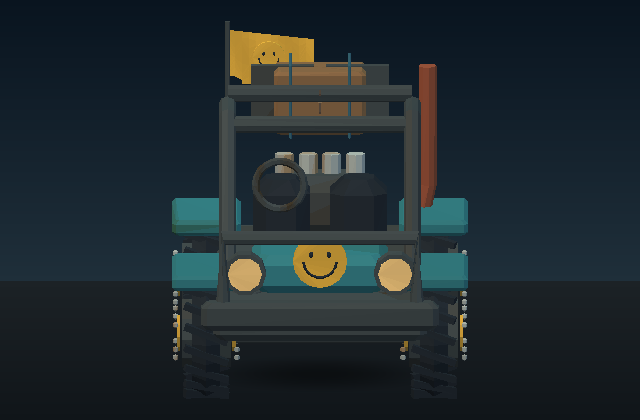
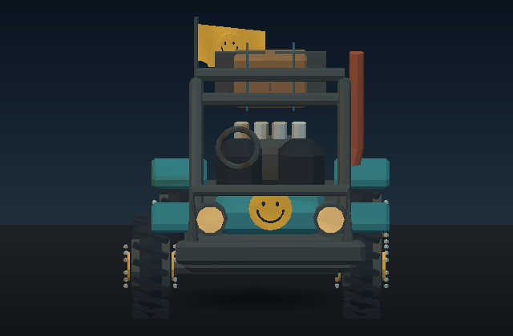
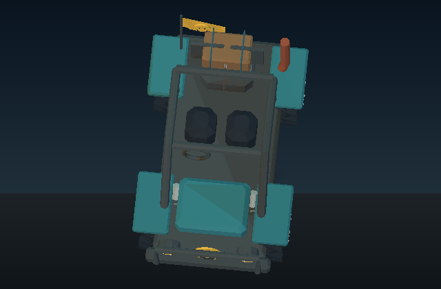
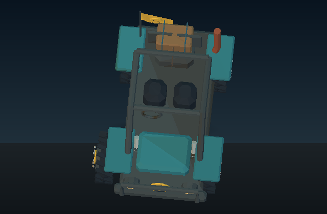
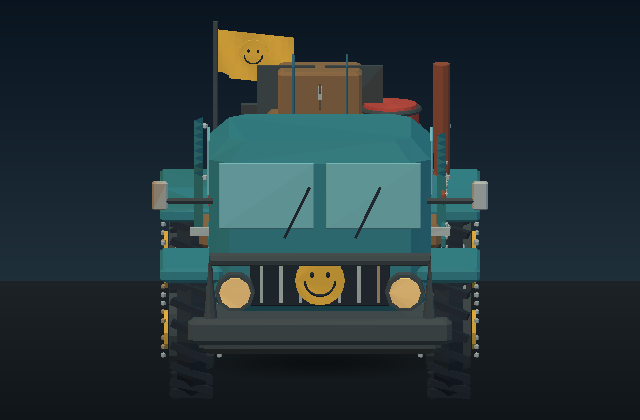
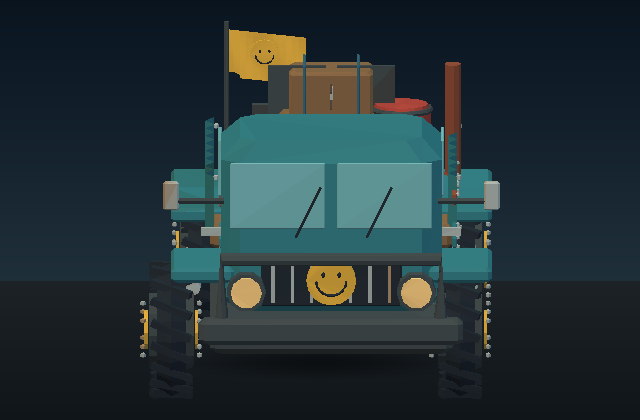
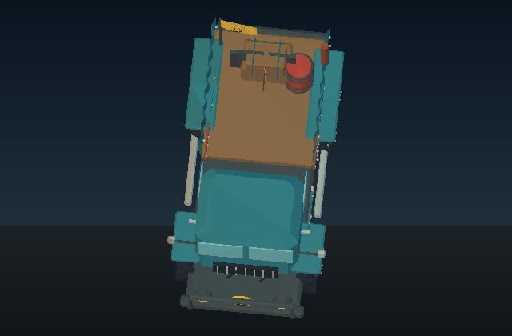
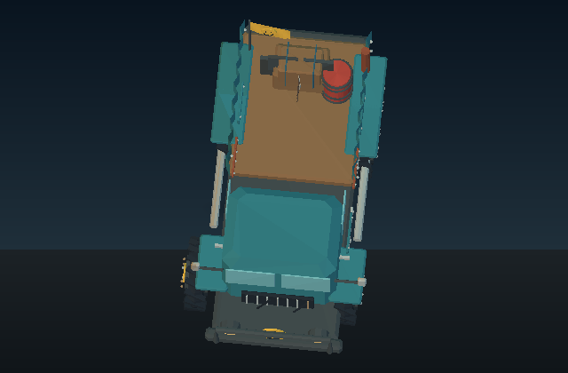

# Learning example — measured repair and reuse on another vehicle

Date: 2026-09-16. Local environment: Linux, Python 3.12.14.
Mike authorized the recommended complete learning example after web research.
Starting lane commit: `5e59672a2dae17f526edccfc80ead11c33a8c60b`, PR #144.
This extends that active PR; no scheduling or merge is implied.

## Implemented

The technical artist station uses UC's existing triangle clearance/contact
measurement, immutable sticker assemblies, native near-detail RTS recipes and
offline GLB inspection renderer. The new `repair-sticker-clearance` action
searches a bounded translation, verifies a built-in parameterized rule and
exports a separate assembly. The crew reconstructs and remeasures the artifacts
before learning. Later work can retrieve the verified rule from crew state,
calculate a new offset for new geometry and recheck it within current limits.

The rule is inspectable data selecting existing deterministic code. This is
retaining and reusing a verified procedure, not synthesizing new code or training
a model. The general skill-library pattern was informed by
[Voyager](https://voyager.minedojo.org/); its GPT-based agent was not imported.

## Actual demonstration

Both inputs use the existing `rts_recipes.vehicle` and `rts_detail.dress` geometry
at near detail. Chassis faces are grouped separately; there is no simplified
collision proxy. Static rest-pose GLBs are explicitly generated for this test.
The original vehicle recipes and animated assets are not changed.

| Observation | Scrap buggy | Flatbed convoy truck |
| --- | ---: | ---: |
| Total triangles | 8,394 | 11,018 |
| Selected wheel / chassis triangles | 852 / 60 | 852 / 60 |
| Initial measured relation | PENETRATING | PENETRATING |
| Required final static gap | 0.060000 m | 0.060000 m |
| Fresh measured final gap | 0.060004 m | 0.060004 m |
| Translation along permitted -X axis | 0.248690 m | 0.238190 m |
| Candidate positions tested in search/application | 5 | 1 |
| Procedure source | Search, then rule validation | Retained procedure |
| Fresh verification | PASS | PASS |

Each job and verification runs in a new Python process. The second job recovers
the first job's procedure from disk; it does not receive the first offset.
Search counts exclude the separate rule validation and fresh verification;
they are not a performance benchmark or a claim of minimum displacement.

The complete geometry-bound render receipts and source digests are in
[demo-report.json](evidence/learning-002/demo-report.json).

## Render inspection

UC's `software_glb_preview` rendered the actual before/after GLBs at 640x420,
studio lighting, front and elevated top views, one static pose, 1x sampling.
The inspection renderer uses automatic framing for each artifact, so these are
not fixed-camera pixel-difference tests. Front views show the selected left
wheel moving outward; the rest of the asset remains present. Top views help
locate that same change. The images do not establish target-renderer material
parity or aesthetic improvement.

| Vehicle / view | Before | After |
| --- | --- | --- |
| Buggy front |  |  |
| Buggy top |  |  |
| Truck front |  |  |
| Truck top |  |  |

## Verification and limits

**105 selected tests passed locally**, including 16 repair tests, existing crew
and target-evidence tests, triangle clearance, preview rendering, machine,
stepwise, tournament and GLB tests. Coverage includes reuse on new dimensions,
changed axis/context/runtime, too-small movement bounds, extra blocking parts,
duplicate experience, fabricated provider PASS, altered GLBs, animation refusal,
existing destination protection and source preservation.

Reproduce:

```sh
PYTHONPATH=src:tests python -m unittest test_profession_crew test_profession_target_evidence test_profession_clearance_repair test_sticker_clearance_contact test_software_glb_preview test_stepwise_workflow test_specialist_tournament test_machine test_procedural_3d test_static_asset_target_evidence -q
python tools/profession_clearance_demo.py creations/clearance-demo
git diff --check
```

The new CI configuration runs those tests plus the two-vehicle learning demo
without rendering on Python 3.11/3.13. Configuration is not a remote pass claim;
check the current PR commit's actual results.

Only **one wheel/chassis pair per vehicle** was repaired. Other wheel contacts,
axle/mount alignment, symmetry, steering, suspension, continuous movement,
physics and target engine behavior remain untested. Moving a wheel outward can
require additional mount/body work. These are verified clearance examples,
not finished vehicle upgrades or professional acceptance. No full UC suite or
Windows run is claimed here. No future task is active.
