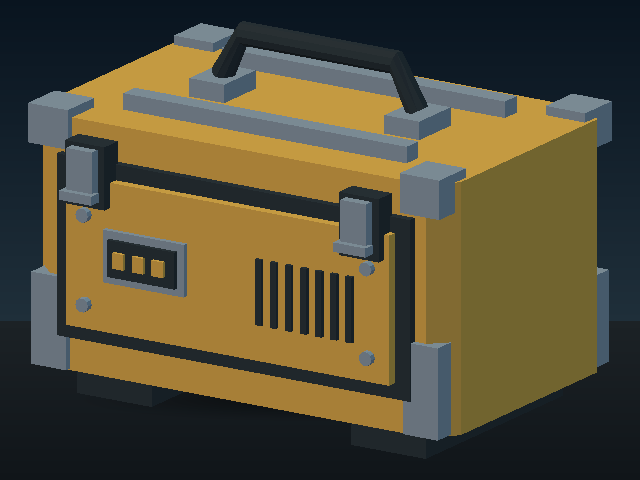
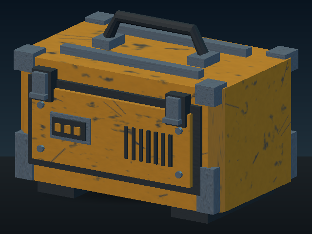
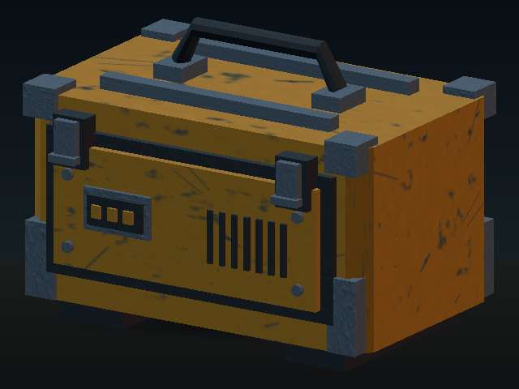

# Product-specific workflows and native texture realization

Date: 2026-09-16. Local environment: Linux, Python 3.12.14.
Mike requested front-to-end workflows based on the product and stronger overall
quality machinery, explicitly asking about textures and missing steps.

## What changed

Eight profiles now describe product-specific chronology, owning professions,
evidence and judgment boundaries: material, static 3D, animated 3D, game,
software, web, image and audio. Four executable draft recipes currently run
through the existing profession crew: materials, supplied static UV geometry,
supplied software source and supplied web source. Plans are compatible with the
existing stepwise workflow; there is no new competing agent coordinator.

The actual texture path now connects:

1. Editable brief, source and explicit quality contract.
2. Existing procedural material families, optional wear/protection layers and
   newly exposed bounded painted-metal surface controls.
3. Fresh map integrity, colour-space, resolution, normal and budget checks.
4. Native UV/texture embedding in the actual GLB, preserving source bundles.
5. Decoded geometry, texture coverage, texel density and optional metre bounds.
6. Actual texture sampling under studio and garage lighting.
7. Preserved revision lineage, draft delivery manifest and scoped crew practice.

Base colour is decoded from sRGB before filtering. Packed ORM channels remain
linear data. -Y source normals are converted in a derivative to glTF's +Y
convention. Mip sampling includes odd-sized texture edges and renormalizes normal
maps. Direct metal/rough shading remains an inspection approximation, with
triangle-derived tangents and no claim of MikkTSpace or target-renderer parity.

## Demonstration and visual repair

`tools/product_workflow_demo.py` constructs an original 656-triangle industrial
field case using UC's surface tools. Every group receives real generated maps.
No external model, artwork, Blender, AI or internet is needed to reproduce it.

The first run generates a map below the brief's declared minimum and stops before
asset publication. A linked revision raises it to 128 pixels, rebuilds the same
geometry, passes fresh map/UV/dimension checks and renders two lighting setups.
The earlier failed draft remains unchanged. Eleven stations run in order in the
successful revision. The output stays `DRAFT_BUILT_REVIEW_REQUIRED`.

Visual inspection caught the old SurfaceBuilder box helper's local X/Z dimension
convention producing a protruding front panel. The demonstration now uses an
explicit XYZ adapter; existing workshop recipes were not rewritten. A maximum
world-dimension check and regression were added to the product path. Another
inspection found excessive bump/wear at this object's scale. Existing metal
controls were exposed in the recipe, then the demonstration reduced normal,
height and wear amplitudes. Old generator defaults remain unchanged.

| Same geometry and camera | Actual rendered result |
| --- | --- |
| Scalar-material baseline |  |
| Native maps, studio lighting |  |
| Native maps, garage lighting |  |

[Exact measurements and source/render digests](evidence/product-003/product-demo-report.json)
and [the actual textured GLB](evidence/product-003/field-service-case.glb) accompany
the source recipe. The inspection shows surface variation and corrected part
placement. It is not a photorealism or finished-asset claim.

## Verification

- **188 selected tests passed locally** on the integrated source: existing crew,
  clearance, target evidence, stepwise, machine, native geometry, materials, UV,
  preview, new product/texture tests, aftertouch integration and portable export.
- The full-size demonstration passed fresh verification with 128-pixel maps and
  640×480 renders in two lighting profiles. Source and rendered file hashes are
  checked before inclusion here.
- Portable export was staged and tested so its tracked-file inventory includes
  all new modules. Extracted-runtime loading and existing behavior passed.
- An earlier broad local discovery ran 998 tests and failed with 27 failures and
  7 errors, including missing donor/creative-hand/Blender files and a stale
  workshop fixture in the reconstructed local snapshot. One portable failure
  was the then-unstaged new modules; the staged portable tests subsequently
  passed. This report does **not** claim the full local suite passed. The
  successor PR runs the full suite on GitHub's complete checkout.

CI now runs the 182 non-portable selected checks and all three executable demos
on Python 3.11 and 3.13. The product demo uses small real renders in CI. The
repository's separate full-suite job remains enabled. Consult the successor PR
for results on its exact published commit; configuration alone is not a pass.

Reproduce the visual example:

```sh
python tools/product_workflow_demo.py creations/product-demo
```

See [PRODUCT_WORKFLOWS.md](../../PRODUCT_WORKFLOWS.md) for the complete contract,
example requests, source references and remaining quality work.

## Continuity and remaining work

PR #144 and aftertouch PR #141 merged while this cycle was running. This work
was reconciled with main `ea6dfc86003380558f38579ffaeb9128de5138f3`: all ten changed
or added main files were copied with their Git blob hashes checked, and runtime
registration merged cleanly. The new publication is a successor in the same
`chatgpt/profession-crew-growth` branch. Physics PR #140 and workshop PR #145
then merged as well. Publication uses main
`6ac748d78fec88c6b201d12bc5fd9fdc67fac376`; its 18-file delta has no overlap with
this product change. Those physics/workshop changes are preserved in the base.

Automatic unwrap/atlas padding, mesh-derived baking and wear, authored decals,
environment reflections, texture compression, deformation extremes, live game
playtests and actual target-engine acceptance remain open. Product planning
exposes these requirements; it does not mark them executed. Refinement currently
rebuilds the explicit recipe into a new directory; dependency-aware partial
rebuilds and autonomous artistic improvement are not implemented.

No automatic merge, product release or scheduled task is created by this work.
