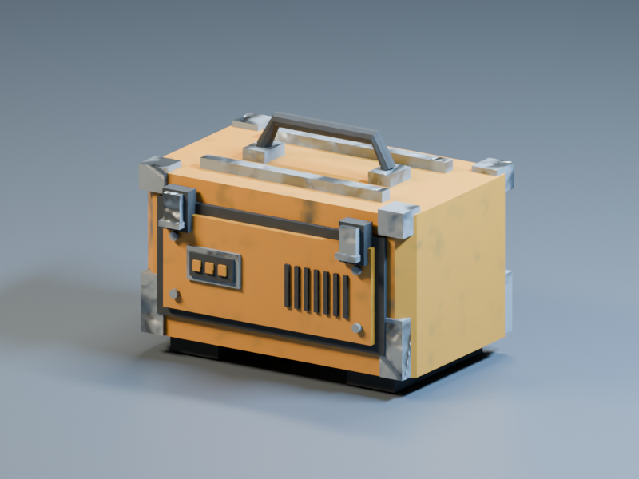
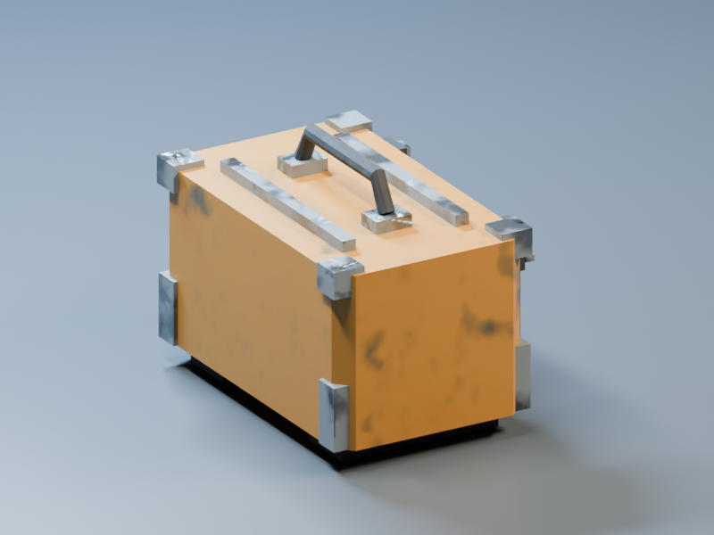
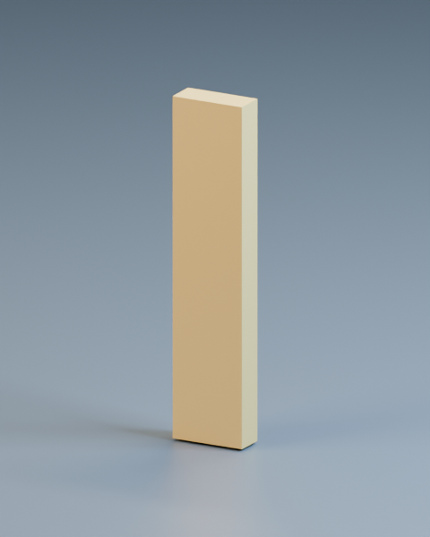
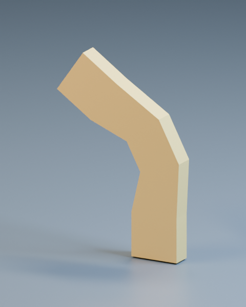

# Run 004 — actual UV, bake, deformation and target production

The five gaps named after Run 003 now have executable, bounded routes in the
existing profession workflow. The static recipe ran 14 observed stations; the
supplied-animation recipe ran four. Both finished
`DRAFT_BUILT_REVIEW_REQUIRED`, with fresh verification PASS and `released: false`.

## Actual output

The same original field-case geometry now receives an automatic unique atlas,
mesh-derived occlusion and actual Cycles reflection lighting. These are renders
of the delivered GLB, not generated illustrations.

[Actual textured GLB](evidence/product-004/field-service-case.glb) ·
[Editable input and recipe](evidence/product-004/case-source.json) ·
[Native inspection render](evidence/product-004/native-studio.png) ·
[Target object-coverage mask](evidence/product-004/case-front-coverage.png)

Visual observation: the front panel, vents, hardware, handle, guards and seals
remain present. Environment and area-source reflections separate steel from
coating/rubber; the floor and assembly produce contact shadows. The revision
reduced overly large scratches and noisy render sampling. Remaining broad
material variation is visible; this fixture is not certified finished art.

The supplied rig was also actually imported and rendered at rest and maximum
authored bend. This is an analytical deformation fixture, not a claim that UC
automatically authored a character rig.

| Rest | Authored bend |
| --- | --- |
|  |  |

[Rigged GLB with closed Flex clip](evidence/product-004/flex.glb)

## Measurements

| Observation | Result |
| --- | --- |
| Case geometry | 656 triangles, three textured material groups; unchanged triangle corners/normals/material identities through unwrap |
| UV charts | 30 paint, 88 rubber, 126 steel; no positive-area overlaps or collapsed UV triangles |
| UV padding | Independent checks passed the requested two-pixel base-level border/island policy at 256×256 |
| Mesh AO | Actual Cycles occlusion baked into the ORM occlusion channel; source maps preserved |
| High-to-low normal integration test | Tilted high surface transferred; independently checked inward rays reject an undersized cage; numeric-suffix group identity preserved |
| Case target comparison | Exact world-bound agreement and triangle-count agreement after fresh Blender import |
| Target object visibility | 128,486 and 121,396 actual asset pixels in the two 800×600 views |
| Good deformation fixture | Nine samples including authored keys; minimum area ratio 0.636610, maximum edge ratio 1.222642 |
| Declared contact and loop | Zero observed fixed-base drift and zero endpoint delta |
| Rig native/Blender comparison | Maximum sampled bound disagreement 0.000000226 m; triangle counts match |
| Deliberate failures | Collapsed extreme fails; missed projection fails; failed declared loop stops the workflow before target execution; tampered artifacts/reports fail fresh observation |

Reports: [UV](evidence/product-004/uv-report.json),
[bake](evidence/product-004/bake-report.json),
[case target](evidence/product-004/target-case.json),
[deformation](evidence/product-004/deformation-report.json),
[rig target](evidence/product-004/target-flex.json),
[deliberate collapse](evidence/product-004/collapsed-extreme.json),
[complete production run](evidence/product-004/production-report.json),
[source/artifact hashes](evidence/product-004/evidence-manifest.json).

## Verification and continuity

Observed environment: Linux, Python 3.12.14, Blender 4.3.2 build `32f5fdce0a0a`,
Cycles CPU using two threads. Target renders used AgX and explicit denoising.
The final large run was `python tools/mesh_production_demo.py <fresh-output>`.
Both products passed their actual crew execution and subsequent fresh observers;
observers repeat backend work, including rendering. The copied source hashes
were compared to the final implementation before publishing evidence.

Before publication: 228 targeted tests were discovered, 225 executed/passed and
three optional Blender tests were exercised separately. The backend/geometry/
precision run executed 24 tests with no skips; ten portable bundle/runtime checks
also passed. A fresh integration check covers the subsequently merged mesh
precision-cutter routing. These test groups overlap; their counts are not summed.

The first published code commit `07b98c05231a4131d176707dc0b4d7247341e872`
passed GitHub's full suite (1,049 tests discovered, three optional tests skipped)
and the separate actual Blender job. The Blender job also ran the complete
quick static/animated demo after downloading the pinned runtime and verifying
the publisher's checksum. Final-head CI status is recorded on PR #150.

PR #146 merged during this continuation. PR #147 and then #149 added precision
cutting on main; their unrelated source is preserved in the follow-up tree.
No older donor attachment replaces current repository authority. No automatic
release, merge, new agent coordinator or hourly schedule was created.

## Scope still open

The actual external target here is **Blender/Cycles**. Unity, Unreal and Godot
gameplay, input/audio integration and device performance need their own adapters
and observations. Also open: UDIM, painted-layout migration, explicit cage
meshes, curvature/thickness, self-intersection, automatic rig creation,
continuous-playback review and artistic acceptance. The native preview still
uses its simpler tangent/shading path. See [Mesh production](../../MESH_PRODUCTION.md)
for executable contracts and precise limits.
