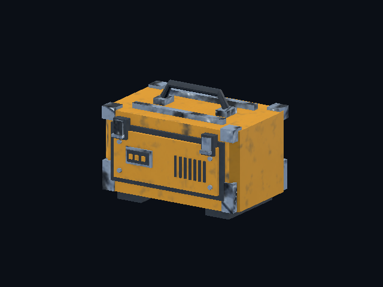
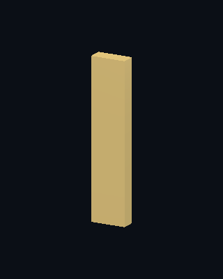
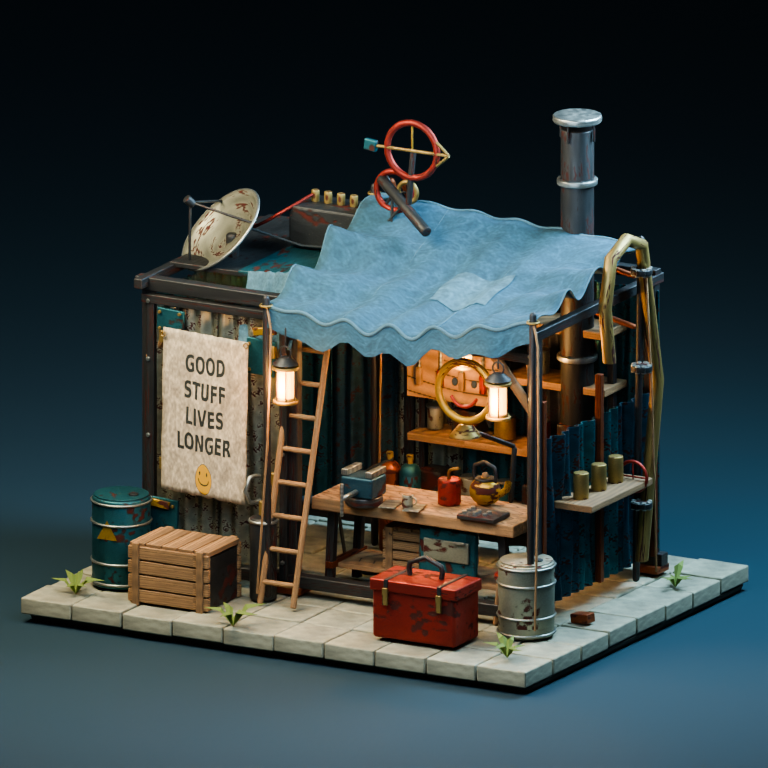

# Run 005 — game-engine observation and the skipped render check

The Blender-only target gap is narrowed by a working **Godot** station in the
existing profession workflow. The formerly skipped workshop render job now
runs for this PR lane and has passed. Unity and Unreal remain open: neither
editor nor its required project/import integration is available in this
workspace, and no adapter or engine pass is claimed for them.

## What executes

`validate-godot-target` runs the supplied embedded GLB in an isolated Godot
project through a fixed worker. It checks the engine actually rendered,
compares posed bounds and triangle counts with UC's independent evaluator,
decodes material texture bindings, captures rendered views and asset-only masks,
and optionally advances the actual AnimationPlayer frame by frame. Source
bytes are preserved. Failed worker runs retain input, worker, logs and FAIL
reports. The observer executes everything again and compares the artifacts.

`production.targets` can require separate Blender/Cycles and Godot stations.
Each station owns its output and evidence. Unknown or duplicate engines and
ambiguous target contracts are rejected before writes. A failure holds later
stations. Existing singular Blender requests continue to work.

The worker is packaged in both the Python wheel and portable source runtime.
The capability does not download runtimes or require AI. Set `AXM_GODOT` to a
local Godot 4.4+ executable with a working graphics display. CI uses pinned
Godot 4.4.1, validates the publisher's SHA512 manifest and runs OpenGL on
Xvfb/Mesa. Dummy headless rendering cannot pass.

Complete machine request:
[product-workflow-multi-target.json](../../examples/requests/product-workflow-multi-target.json).
Run with `PYTHONPATH=src python -m axm_uc create examples/requests/product-workflow-multi-target.json`.
Both optional runtimes must be configured for that request.

## Actual Godot evidence

The same original field case from Run 004 was imported; this is a new engine
observation, not a new asset claimed as fresh artwork.

[Back view](evidence/product-005/godot-case-back.png) ·
[Asset-only mask](evidence/product-005/godot-case-coverage.png) ·
[Case report](evidence/product-005/godot-case-report.json)

Observed: the handle, front controls/vents, hinges, corner guards and ochre
coating remain visible. This simple diagnostic lighting does not match Cycles
look development and is not an artistic improvement claim.

The authored rig was stepped through a full one-second closed flex, using 25
frames at 24 steps per second. The GIF below is a viewing derivative of those
actual frames; the original PNG frames and masks remain in the evidence ZIP.

[Rest](evidence/product-005/godot-flex-rest.png) ·
[Bent](evidence/product-005/godot-flex-bent.png) ·
[Animation report](evidence/product-005/godot-flex-report.json) ·
[Complete engine evidence ZIP](evidence/product-005/godot-target-evidence.zip) ·
[Fresh observers](evidence/product-005/godot-verification.json) ·
[Source and artifact hashes](evidence/product-005/evidence-manifest.json)

| Observation | Result |
| --- | --- |
| Actual target | Godot 4.4.1 official; OpenGL compatibility; X11; Mesa llvmpipe LLVM 20.1.2 |
| Case posed bounds vs native | Maximum difference 0.0000000596 m; triangle counts match |
| Case visibility | 56,604 front and 53,487 back asset-mask pixels at 640×480 |
| Texture bindings | Expected albedo, normal, roughness, metallic and AO bindings decode in the engine |
| Authored rig playback | 25 frames; maximum bound disagreement 0.000000118 m; triangle counts match |
| Fresh reproduction | Both complete demos PASS, including exact repeated render artifacts on this backend |
| Direct engine tests | 11 passed, none skipped, including actual textured and animated product crews, forged report and render tampering |

The first actual run exposed an integration defect: Godot's valid PNG ancillary
metadata was rejected by UC's intentionally narrow native decoder. The repair
checks each chunk CRC and removes metadata while preserving the RGB scanlines.
Corrupted CRCs and unknown critical chunks remain rejected. Geometry and
animation checks were not weakened.

## Formerly skipped workshop observation

The existing workshop generation/import/render job was restricted to its
original branch prefix. This lane is now explicitly included. It actually
generated the existing 190,431-triangle workshop, freshly imported 19 mesh
batches, rendered front/rear/detail views, and passed its independent verifier.
All three views were inspected. Geometry structure is tested; collision,
target RTS integration and artistic acceptance remain explicitly untested.

[Workshop verification](evidence/product-005/workshop-verification.json) ·
[Game-readiness boundaries](evidence/product-005/workshop-game-readiness.json)

## Verification and remaining boundaries

The verified code commit for the Godot evidence is
`e4271a9ba2f20992979dab874bafff45f3304f59`.
[Godot job](https://github.com/mike-axiom-mir/axm-universal-creation/actions/runs/35072004076/job/104715442387)
passed both product integration tests and both larger demos.
[Workshop evidence job](https://github.com/mike-axiom-mir/axm-universal-creation/actions/runs/35071427660/job/104713623896)
passed on `ff8f39e76a607cec69f74caffe1d2e5c281f4793`; the workshop source is
unchanged by the later PNG handoff repair. Final-head checks are on PR #150.

The full GitHub suite discovered 1,082 tests and passed, with five optional
backend tests exercised in the separate Blender/Godot jobs. All 22 checks on
that code head passed, with no skipped jobs. A local native/integration run
discovered 85 tests, passed 82 and skipped three optional Blender tests.
Latest-main fabrication/cutter integration and portable checks also passed. These groups overlap and their counts are not summed.
The first local fixture-path error was repaired by moving fixture artifacts
under `creations/`, preserving UC's machine-body protection.

Still open: Unity/Unreal adapters and execution, real gameplay/input/audio
tests, measured device framerate, continuous real-time playback review and
artistic acceptance. Earlier explicitly listed production extensions such as
UDIM, painted-atlas migration, automatic rigging, curvature/thickness and
self-intersection are not silently claimed by this target-observation work.
Product output remains review-required with `released: false`.

Continuity: same PR #150 and branch. Main's oriented precision cutter and mesh
fabrication chains, including subsequent mesh-hole work, are preserved through
`e63274d1b0f4f095bef130dac474fe43a0deb090`.
The separate native unwrap/bake lane #153 was inspected and not overwritten.
No merge, release or schedule is created by this run.
